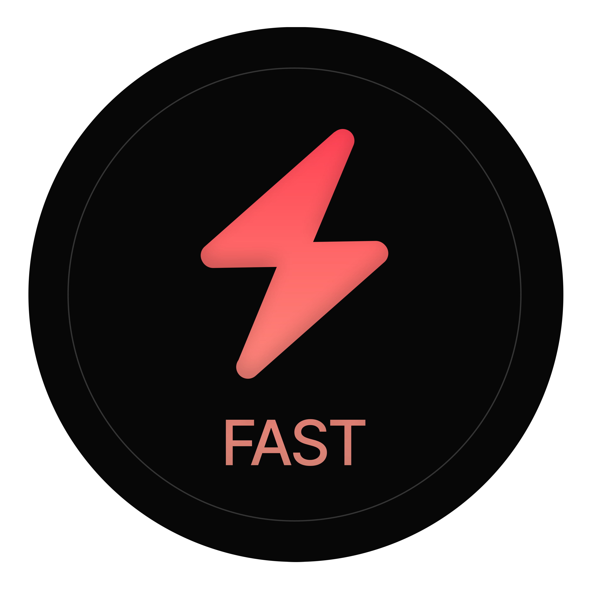

    
  

    requests - but as <b>fast</b> as possible
    Asynchronous multi-threaded requests via concurrently linked queues. 
  
    The best template for any fast web scraper.
  

  
  
<!-- Badges -->

  

  <!--
  
  -->
  
  
  
  
  
  
  
  <!--
  -->

   
<h4>
    <a href="https://github.com/couldbejake/fast/issues">Report Bug</a>
   · 
    <a href="https://github.com/couldbejake/fast/issues/new">Request Feature</a>
   · 
    <a href="https://www.buymeacoffee.com/couldbejake">Support this project</a>
  </h4>

<!-- Getting Started -->
## WIP: Information coming soon

Original Repo: Debug development repo for scraping tweets and market data via RDS. Using optimisations techniques such as (Threading, asynchronous I/O, non-blocking I/O - ConcurrentLinkedQueues, and runnable tasks for making requests and saving tweets to the database. (Rewritten in Java)

Adjust speed:

Scraper scraper = new Scraper(2, 2000, 10);

To adjust scraper rate, ensure your internet is fast enough, the scraper will increase in speed over time, as optimum proxies are found.

Run the program as is, the debug version does not download from Twitter. Achieved RPS will be shown in the console.

PLEASE NOTE THE FOLLOWING:
- This code only runs properly on Linux, preferably cloud hosted.
- The program initially takes time to work out which proxies are most successful.
- If settings in Main.java are too high, the program will fail all requests.
- The bot uses public proxies, enter proxies in checked_proxies.txt
- !!! The bot must have excessive internet bandwidth.
- On Linux, max open files should be set to a high number
  
Troubleshooting
- Requests drop to 0
    - Maybe you're using too many resources - there's a perfect balance.
        - Having too many worker threads leads to blocks and switching between threads - slowing the system down.
        - Using too much memory and the program can't allocate memory
    - There are no proxies available
    - There are no tasks left
    - You have reached the maximum co-currency
        - Something may be causing a hang - ie. in the request handler, ie. not updating the coroutine count properly

